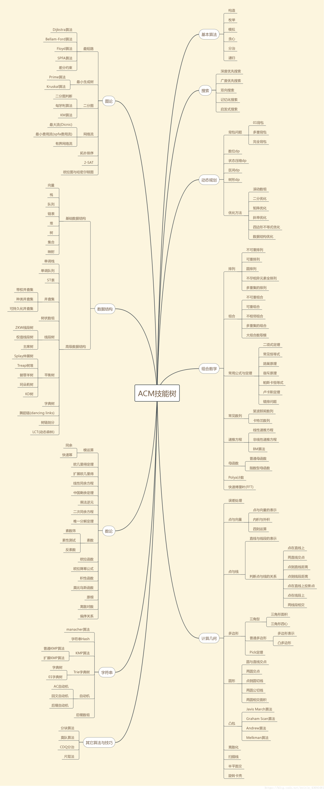

> 你不努力肯定会有努力的人，你真的愿意一辈子这样了吗？


## 1.排序
### 1.选择排序
1. 用俩个指针，一个从0开始，一个往后遍历，如果有比第一个小的就记录，遍历所有数据就交换小的数据到第一个指针位置，没有就直接不变，然后就是重复遍历之道第一个指针（下标）到最后一个数据。
2. 代码
```c++
template<typename T> //整數或浮點數皆可使用，若要使用物件（class）時必須設定大於（>）的運算子功能
      void selection_sort(std::vector<T>& arr) {
              for (int i = 0; i < arr.size() - 1; i++) {
                      int min = i;
                      for (int j = i + 1; j < arr.size(); j++)
                              if (arr[j] < arr[min])
                                      min = j;
                      std::swap(arr[i], arr[min]);
              }
      }
```
3. 演示图

### 2.冒泡排序
1. 这个就是遇到比第一个小的就交换数据，或者位置，直到最小的都交换到第一个位置。重复遍历。
2. 代码
```c++
	  #include <iostream>
      using namespace std;
      template<typename T> //整数或浮点数皆可使用,若要使用类(class)或结构体(struct)时必须重载大于(>)运算符
      void bubble_sort(T arr[], int len) {
              int i, j;
              for (i = 0; i < len - 1; i++)
                      for (j = 0; j < len - 1 - i; j++)
                              if (arr[j] > arr[j + 1])
                                      swap(arr[j], arr[j + 1]);
      }
      int main() {
              int arr[] = { 61, 17, 29, 22, 34, 60, 72, 21, 50, 1, 62 };
              int len = (int) sizeof(arr) / sizeof(*arr);
              bubble_sort(arr, len);
              for (int i = 0; i < len; i++)
                      cout << arr[i] << ' ';
              cout << endl;
              float arrf[] = { 17.5, 19.1, 0.6, 1.9, 10.5, 12.4, 3.8, 19.7, 1.5, 25.4, 28.6, 4.4, 23.8, 5.4 };
              len = (float) sizeof(arrf) / sizeof(*arrf);
              bubble_sort(arrf, len);
              for (int i = 0; i < len; i++)
                      cout << arrf[i] << ' '<<endl;
              return 0;
      }
```
3. 演示图
![[./picture01/bubbleSort.gif]]
### 3. 插入排序
1. 将第一待排序序列第一个元素看做一个有序序列，把第二个元素到最后一个元素当成是未排序序列。从头到尾依次扫描未排序序列，将扫描到的每个元素插入有序序列的适当位置。（如果待插入的元素与有序序列中的某个元素相等，则将待插入元素插入到相等元素的后面）
2. 代码
```c++
 void insertion_sort(int arr[],int len){
              for(int i=1;i<len;i++){
                      int key=arr[i];
                      int j=i-1;
                      while((j>=0) && (key<arr[j])){
                              arr[j+1]=arr[j];
                              j--;
                      }
                      arr[j+1]=key;
              }
      }
```
3. 演示图
 ![[./picture01/insertionSort.gif]]
### 4.快速排序
 1. 步骤
	 1. 从数列中挑出一个元素，称为 "基准"（pivot）;
      2. 重新排序数列，所有元素比基准值小的摆放在基准前面，所有元素比基准值大的摆在基准的后面（相同的数可以到任一边）。在这个分区退出之后，该基准就处于数列的中间位置。这个称为分区（partition）操作；
      3. 递归地（recursive）把小于基准值元素的子数列和大于基准值元素的子数列排序；
  2. 代码
```C++
sort(a,a + n);// 排序a[0]-a[n-1]的所有数.
```
[参考](http://www.dutor.net/index.php/2011/04/recursive-iterative-quick-sort/)
```c++
// 参考：http://www.dutor.net/index.php/2011/04/recursive-iterative-quick-sort/
      //迭代法
      struct Range {
          int start, end;
          Range(int s = 0, int e = 0) {
              start = s, end = e;
          }
      };
      template <typename T> // 整數或浮點數皆可使用,若要使用物件(class)時必須設定"小於"(<)、"大於"(>)、"不小於"(>=)的運算子功能
      void quick_sort(T arr[], const int len) {
          if (len <= 0)
              return; // 避免len等於負值時宣告堆疊陣列當機
          // r[]模擬堆疊,p為數量,r[p++]為push,r[--p]為pop且取得元素
          Range r[len];
          int p = 0;
          r[p++] = Range(0, len - 1);
          while (p) {
              Range range = r[--p];
              if (range.start >= range.end)
                  continue;
              T mid = arr[range.end];
              int left = range.start, right = range.end - 1;
              while (left < right) {
                  while (arr[left] < mid && left < right) left++;
                  while (arr[right] >= mid && left < right) right--;
                  std::swap(arr[left], arr[right]);
              }
              if (arr[left] >= arr[range.end])
                  std::swap(arr[left], arr[range.end]);
              else
                  left++;
              r[p++] = Range(range.start, left - 1);
              r[p++] = Range(left + 1, range.end);
          }
      }
```
```c++
//递归法
      template <typename T>
      void quick_sort_recursive(T arr[], int start, int end) {
          if (start >= end)
              return;
          T mid = arr[end];
          int left = start, right = end - 1;
          while (left < right) { //在整个范围内搜寻比枢纽元值小或大的元素，然后将左侧元素与右侧元素交换
              while (arr[left] < mid && left < right) //试图在左侧找到一个比枢纽元更大的元素
                  left++;
              while (arr[right] >= mid && left < right) //试图在右侧找到一个比枢纽元更小的元素
                  right--;
              std::swap(arr[left], arr[right]); //交换元素
          }
          if (arr[left] >= arr[end])
              std::swap(arr[left], arr[end]);
          else
              left++;
          quick_sort_recursive(arr, start, left - 1);
          quick_sort_recursive(arr, left + 1, end);
      }
      template <typename T> //整數或浮點數皆可使用,若要使用物件(class)時必須設定"小於"(<)、"大於"(>)、"不小於"(>=)的運算子功能
      void quick_sort(T arr[], int len) {
          quick_sort_recursive(arr, 0, len - 1);
      }
```
3. 演示图
![[./picture01/quickSort.gif]]
### 5. 堆排序
1. 堆排序（Heapsort）是指利用堆这种数据结构所设计的一种排序算法。堆积是一个近似完全二叉树的结构，并同时满足堆积的性质：即子结点的键值或索引总是小于（或者大于）它的父节点。堆排序可以说是一种利用堆的概念来排序的选择排序。分为两种方法：
      1. 大顶堆：每个节点的值都大于或等于其子节点的值，在堆排序算法中用于升序排列；
      2. 小顶堆：每个节点的值都小于或等于其子节点的值，在堆排序算法中用于降序排列；
      堆排序的平均时间复杂度为 Ο(nlogn)。
2. 算法步骤
      1. 创建一个堆 H[0……n-1]；
      2. 把堆首（最大值）和堆尾互换；
      3. 把堆的尺寸缩小 1，并调用 shift_down(0)，目的是把新的数组顶端数据调整到相应位置；
      4. 重复步骤 2，直到堆的尺寸为 1。

   3. 代码
```c++
 #include <iostream>
      #include <algorithm>
      using namespace std;
      
      void max_heapify(int arr[], int start, int end) {
          // 建立父節點指標和子節點指標
          int dad = start;
          int son = dad * 2 + 1;
          while (son <= end) { // 若子節點指標在範圍內才做比較
              if (son + 1 <= end && arr[son] < arr[son + 1]) // 先比較兩個子節點大小，選擇最大的
                  son++;
              if (arr[dad] > arr[son]) // 如果父節點大於子節點代表調整完畢，直接跳出函數
                  return;
              else { // 否則交換父子內容再繼續子節點和孫節點比較
                  swap(arr[dad], arr[son]);
                  dad = son;
                  son = dad * 2 + 1;
              }
          }
      }
      
      void heap_sort(int arr[], int len) {
          // 初始化，i從最後一個父節點開始調整
          for (int i = len / 2 - 1; i >= 0; i--)
              max_heapify(arr, i, len - 1);
          // 先將第一個元素和已经排好的元素前一位做交換，再從新調整(刚调整的元素之前的元素)，直到排序完畢
          for (int i = len - 1; i > 0; i--) {
              swap(arr[0], arr[i]);
              max_heapify(arr, 0, i - 1);
          }
      }
      
      int main() {
          int arr[] = { 3, 5, 3, 0, 8, 6, 1, 5, 8, 6, 2, 4, 9, 4, 7, 0, 1, 8, 9, 7, 3, 1, 2, 5, 9, 7, 4, 0, 2, 6 };
          int len = (int) sizeof(arr) / sizeof(*arr);
          heap_sort(arr, len);
          for (int i = 0; i < len; i++)
              cout << arr[i] << ' ';
          cout << endl;
          return 0;
      }
```
4. 演示图
![[./picture01/heapSort.gif]]![[./picture01/Sorting_heapsort_anim.gif]]
### 6.希尔排序
1. 希尔排序，也称递减增量排序算法，是插入排序的一种更高效的改进版本。但希尔排序是非稳定排序算法。
      希尔排序是基于插入排序的以下两点性质而提出改进方法的：
      - 插入排序在对几乎已经排好序的数据操作时，效率高，即可以达到线性排序的效率；
      - 但插入排序一般来说是低效的，因为插入排序每次只能将数据移动一位；
      希尔排序的基本思想是：先将整个待排序的记录序列分割成为若干子序列分别进行直接插入排序，待整个序列中的记录"基本有序"时，再对全体记录进行依次直接插入排序。
   2. 步骤
      + 选择一个增量序列 t1，t2，……，tk，其中 ti > tj, tk = 1；
      + 按增量序列个数 k，对序列进行 k 趟排序；
      + 每趟排序，根据对应的增量 ti，将待排序列分割成若干长度为 m 的子序列，分别对各子表进行直接插入排序。仅增量因子为 1 时，整个序列作为一个表来处理，表长度即为整个序列的长度。
   3. 代码
```c++
template<typename T>
      void shell_sort(T array[], int length) {
          int h = 1;
          while (h < length / 3) {
              h = 3 * h + 1;
          }
          while (h >= 1) {
              for (int i = h; i < length; i++) {
                  for (int j = i; j >= h && array[j] < array[j - h]; j -= h) {
                      std::swap(array[j], array[j - h]);
                  }
              }
              h = h / 3;
          }
      }
```
4. 演示图
![[./picture01/Sorting_shellsort_anim.gif]]
### 7.归并排序
1. 归并排序（Merge sort）是建立在归并操作上的一种有效的排序算法。该算法是采用分治法（Divide and Conquer）的一个非常典型的应用。
      作为一种典型的分而治之思想的算法应用，归并排序的实现由两种方法：
      - 自上而下的递归（所有递归的方法都可以用迭代重写，所以就有了第 2 种方法）；
      - 自下而上的迭代；
>	在《数据结构与算法 JavaScript 描述》中，作者给出了自下而上的迭代方法。但是对于递归法，作者却认为：
 > 	However, it is not possible to do so in JavaScript, as the recursion goes too deep for the language to handle.
	然而，在 JavaScript 中这种方式不太可行，因为这个算法的递归深度对它来讲太深了。
      说实话，我不太理解这句话。意思是 JavaScript 编译器内存太小，递归太深容易造成内存溢出吗？还望有大神能够指教。
      和选择排序一样，归并排序的性能不受输入数据的影响，但表现比选择排序好的多，因为始终都是 O(nlogn) 的时间复杂度。代价是需要额外的内存空间。

   2.  算法步骤
	  1. 申请空间，使其大小为两个已经排序序列之和，该空间用来存放合并后的序列；
	  2. 设定两个指针，最初位置分别为两个已经排序序列的起始位置；
	  3. 比较两个指针所指向的元素，选择相对小的元素放入到合并空间，并移动指针到下一位置；
	  4. 重复步骤 3 直到某一指针达到序列尾；
	  5. 将另一序列剩下的所有元素直接复制到合并序列尾。
   3. 代码
```c++
//迭代版：
      template<typename T> // 整數或浮點數皆可使用,若要使用物件(class)時必須設定"小於"(<)的運算子功能
      void merge_sort(T arr[], int len) {
          T *a = arr;
          T *b = new T[len];
          for (int seg = 1; seg < len; seg += seg) {
              for (int start = 0; start < len; start += seg + seg) {
                  int low = start, mid = min(start + seg, len), high = min(start + seg + seg, len);
                  int k = low;
                  int start1 = low, end1 = mid;
                  int start2 = mid, end2 = high;
                  while (start1 < end1 && start2 < end2)
                      b[k++] = a[start1] < a[start2] ? a[start1++] : a[start2++];
                  while (start1 < end1)
                      b[k++] = a[start1++];
                  while (start2 < end2)
                      b[k++] = a[start2++];
              }
              T *temp = a;
              a = b;
              b = temp;
          }
          if (a != arr) {
              for (int i = 0; i < len; i++)
                  b[i] = a[i];
              b = a;
          }
          delete[] b;
      }
```
```c++
 //递归版：
      void Merge(vector<int> &Array, int front, int mid, int end) {
          // preconditions:
          // Array[front...mid] is sorted
          // Array[mid+1 ... end] is sorted
          // Copy Array[front ... mid] to LeftSubArray
          // Copy Array[mid+1 ... end] to RightSubArray
          vector<int> LeftSubArray(Array.begin() + front, Array.begin() + mid + 1);
          vector<int> RightSubArray(Array.begin() + mid + 1, Array.begin() + end + 1);
          int idxLeft = 0, idxRight = 0;
          LeftSubArray.insert(LeftSubArray.end(), numeric_limits<int>::max());
          RightSubArray.insert(RightSubArray.end(), numeric_limits<int>::max());
          // Pick min of LeftSubArray[idxLeft] and RightSubArray[idxRight], and put into Array[i]
          for (int i = front; i <= end; i++) {
              if (LeftSubArray[idxLeft] < RightSubArray[idxRight]) {
                  Array[i] = LeftSubArray[idxLeft];
                  idxLeft++;
              } else {
                  Array[i] = RightSubArray[idxRight];
                  idxRight++;
              }
          }
      }
      
      void MergeSort(vector<int> &Array, int front, int end) {
          if (front >= end)
              return;
          int mid = (front + end) / 2;
          MergeSort(Array, front, mid);
          MergeSort(Array, mid + 1, end);
          Merge(Array, front, mid, end);
      }
```
4. 演示图
![[./picture01/mergeSort.gif]]
### 8.计数排序
1. 计数排序的核心在于将输入的数据值转化为键存储在额外开辟的数组空间中。作为一种线性时间复杂度的排序，计数排序要求输入的数据必须是有确定范围的整数。
2. 计数排序的特征
	+ 当输入的元素是 n 个 0 到 k 之间的整数时，它的运行时间是 Θ(n + k)。计数排序不是比较排序，排序的速度快于任何比较排序算法。
	+ 由于用来计数的数组C的长度取决于待排序数组中数据的范围（等于待排序数组的最大值与最小值的差加上1），这使得计数排序对于数据范围很大的数组，需要大量时间和内存。例如：计数排序是用来排序0到100之间的数字的最好的算法，但是它不适合按字母顺序排序人名。但是，计数排序可以用在基数排序中的算法来排序数据范围很大的数组。
	+ 通俗地理解，例如有 10 个年龄不同的人，统计出有 8 个人的年龄比 A 小，那 A 的年龄就排在第 9 位,用这个方法可以得到其他每个人的位置,也就排好了序。当然，年龄有重复时需要特殊处理（保证稳定性），这就是为什么最后要反向填充目标数组，以及将每个数字的统计减去 1 的原因。
	+ 算法的步骤如下：
		  - （1）找出待排序的数组中最大和最小的元素
		  - （2）统计数组中每个值为i的元素出现的次数，存入数组C的第i项
		  - （3）对所有的计数累加（从C中的第一个元素开始，每一项和前一项相加）
		  - （4）反向填充目标数组：将每个元素i放在新数组的第C(i)项，每放一个元素就将C(i)减去1。
3. 代码
```c++
 #include <stdio.h>
      #include <stdlib.h>
      #include <time.h>
      
      void print_arr(int *arr, int n) {
              int i;
              printf("%d", arr[0]);
              for (i = 1; i < n; i++)
                      printf(" %d", arr[i]);
              printf("\n");
      }
      
      void counting_sort(int *ini_arr, int *sorted_arr, int n) {
              int *count_arr = (int *) malloc(sizeof(int) * 100);
              int i, j, k;
              for (k = 0; k < 100; k++)
                      count_arr[k] = 0;
              for (i = 0; i < n; i++)
                      count_arr[ini_arr[i]]++;
              for (k = 1; k < 100; k++)
                      count_arr[k] += count_arr[k - 1];
              for (j = n; j > 0; j--)
                      sorted_arr[--count_arr[ini_arr[j - 1]]] = ini_arr[j - 1];
              free(count_arr);
      }
      
      int main(int argc, char **argv) {
              int n = 10;
              int i;
              int *arr = (int *) malloc(sizeof(int) * n);
              int *sorted_arr = (int *) malloc(sizeof(int) * n);
              srand(time(0));
              for (i = 0; i < n; i++)
                      arr[i] = rand() % 100;
              printf("ini_array: ");
              print_arr(arr, n);
              counting_sort(arr, sorted_arr, n);
              printf("sorted_array: ");
              print_arr(sorted_arr, n);
              free(arr);
              free(sorted_arr);
              return 0;
      }
```
4. 演示图
   ![[./picture01/countingSort.gif]]
### 9.桶排序
   1. 桶排序是计数排序的升级版。它利用了函数的映射关系，高效与否的关键就在于这个映射函数的确定。为了使桶排序更加高效，我们需要做到这两点：

      1. 在额外空间充足的情况下，尽量增大桶的数量
      2. 使用的映射函数能够将输入的 N 个数据均匀的分配到 K 个桶中

      同时，对于桶中元素的排序，选择何种比较排序算法对于性能的影响至关重要。

   2. 1. 什么时候最快
        当输入的数据可以均匀的分配到每一个桶中。
      2. 什么时候最慢
        当输入的数据被分配到了同一个桶中。
      3. 示意图
        元素分布在桶中：
        
        然后，元素在每个桶中排序：
        
        
   3. 代码
```c++
#include<iterator>
      #include<iostream>
      #include<vector>
      using namespace std;
      const int BUCKET_NUM = 10;
      
      struct ListNode{
              explicit ListNode(int i=0):mData(i),mNext(NULL){}
              ListNode* mNext;
              int mData;
      };
      
      ListNode* insert(ListNode* head,int val){
              ListNode dummyNode;
              ListNode *newNode = new ListNode(val);
              ListNode *pre,*curr;
              dummyNode.mNext = head;
              pre = &dummyNode;
              curr = head;
              while(NULL!=curr && curr->mData<=val){
                      pre = curr;
                      curr = curr->mNext;
              }
              newNode->mNext = curr;
              pre->mNext = newNode;
              return dummyNode.mNext;
      }
      
      
      ListNode* Merge(ListNode *head1,ListNode *head2){
              ListNode dummyNode;
              ListNode *dummy = &dummyNode;
              while(NULL!=head1 && NULL!=head2){
                      if(head1->mData <= head2->mData){
                              dummy->mNext = head1;
                              head1 = head1->mNext;
                      }else{
                              dummy->mNext = head2;
                              head2 = head2->mNext;
                      }
                      dummy = dummy->mNext;
              }
              if(NULL!=head1) dummy->mNext = head1;
              if(NULL!=head2) dummy->mNext = head2;
              
              return dummyNode.mNext;
      }
      
      void BucketSort(int n,int arr[]){
              vector<ListNode*> buckets(BUCKET_NUM,(ListNode*)(0));
              for(int i=0;i<n;++i){
                      int index = arr[i]/BUCKET_NUM;
                      ListNode *head = buckets.at(index);
                      buckets.at(index) = insert(head,arr[i]);
              }
              ListNode *head = buckets.at(0);
              for(int i=1;i<BUCKET_NUM;++i){
                      head = Merge(head,buckets.at(i));
              }
              for(int i=0;i<n;++i){
                      arr[i] = head->mData;
                      head = head->mNext;
              }
      }
```
### 10.基数排序
1. 基数排序是一种非比较型整数排序算法，其原理是将整数按位数切割成不同的数字，然后按每个位数分别比较。由于整数也可以表达字符串（比如名字或日期）和特定格式的浮点数，所以基数排序也不是只能使用于整数。
2. 代码
```c++
	int maxbit(int data[], int n) //辅助函数，求数据的最大位数
       {
           int maxData = data[0];              ///< 最大数
           /// 先求出最大数，再求其位数，这样有原先依次每个数判断其位数，稍微优化点。
           for (int i = 1; i < n; ++i)
           {
               if (maxData < data[i])
                   maxData = data[i];
           }
           int d = 1;
           int p = 10;
           while (maxData >= p)
           {
               //p *= 10; // Maybe overflow
               maxData /= 10;
               ++d;
           }
           return d;
       /*    int d = 1; //保存最大的位数
           int p = 10;
           for(int i = 0; i < n; ++i)
           {
               while(data[i] >= p)
               {
                   p *= 10;
                   ++d;
               }
           }
           return d;*/
       }
       void radixsort(int data[], int n) //基数排序
       {
           int d = maxbit(data, n);
           int *tmp = new int[n];
           int *count = new int[10]; //计数器
           int i, j, k;
           int radix = 1;
           for(i = 1; i <= d; i++) //进行d次排序
           {
               for(j = 0; j < 10; j++)
                   count[j] = 0; //每次分配前清空计数器
               for(j = 0; j < n; j++)
               {
                   k = (data[j] / radix) % 10; //统计每个桶中的记录数
                   count[k]++;
               }
               for(j = 1; j < 10; j++)
                   count[j] = count[j - 1] + count[j]; //将tmp中的位置依次分配给每个桶
               for(j = n - 1; j >= 0; j--) //将所有桶中记录依次收集到tmp中
               {
                   k = (data[j] / radix) % 10;
                   tmp[count[k] - 1] = data[j];
                   count[k]--;
               }
               for(j = 0; j < n; j++) //将临时数组的内容复制到data中
                   data[j] = tmp[j];
               radix = radix * 10;
           }
           delete []tmp;
           delete []count;
       }
```
3. 演示图


## 2. 位运算
### 1.逻辑运算
+ 逻辑与 && ：就是俩个都为才为真
+ 逻辑或 || ： 就是只有俩个都为假才为假
+ 逻辑非 ！：就是取相反数
### 2. 按位运算
+ 按位与  &： 对于二进制的运算，数据转化为2进制然后俩个都为1才为1，否则为0。
+ 按位或 | ：俩者为0才为0.否则为1.
+ 按位异或 ^ : 俩个相同为0，相反为1.
+ 按位非 ~ ： 就是取相反数。
### 3. 码
+ 原码：一个数直接转化为二进制得到的01序列。
+ 反码：将所有的原码取反就是反码。
+ 补码：将原码全部取反再加1。
### 4. 常用的技巧
+ 用于二进制的技巧
 ![[./picture01/Pasted image 20240112182548.png]]
 + 用于一些运算的技巧
![[./picture01/Pasted image 20240112183227.png]]
+ 集合枚举
![[./picture01/Pasted image 20240112183440.png]]

## 3.KMP算法
### 1.字符串匹配问题
+ 字符串匹配是实际工作生活中经常遇到的问题，例如我们经常在网页，文本使用Ctrl + F查找关键词等等。
+ 字符串匹配问题简单来说就是要在字符串s中查找某个字符串p是否出现。
+ KMP（Knuth-Morris-Pratt）算法可以用线性的时间复杂度解决字符串匹配问题。
+ 假设现在我们面临这样一个问题：有一个文本串S，和一个模式串P，现在要查找P在S中的位置，怎么查找呢？
	+  如果用暴力匹配的思路，并假设现在文本串S匹配到 i 位置，模式串P匹配到 j 位置，则有：
		+ 如果当前字符匹配成功（即S[i] == P[j]），则i++，j++，继续匹配下一个字符；
		+ 如果失配（即S[i]! = P[j]），令i = i - (j - 1)，j = 0。相当于每次匹配失败时，i 回溯，j 被置为0。
	+ 理清楚了暴力匹配算法的流程及内在的逻辑，咱们可以写出暴力匹配的代码，如下：
```c++
int ViolentMatch(char* s, char* p)
{
	int sLen = strlen(s);
	int pLen = strlen(p);
 
	int i = 0;
	int j = 0;
	while (i < sLen && j < pLen)
	{
		if (s[i] == p[j])
		{
			//①如果当前字符匹配成功（即S[i] == P[j]），则i++，j++    
			i++;
			j++;
		}
		else
		{
			//②如果失配（即S[i]! = P[j]），令i = i - (j - 1)，j = 0    
			i = i - j + 1;
			j = 0;
		}
	}
	//匹配成功，返回模式串p在文本串s中的位置，否则返回-1
	if (j == pLen)
		return i - j;
	else
		return -1;
}
```
+ KMP算法
	+ 假设现在文本串S匹配到 i 位置，模式串P匹配到 j 位置
		+ - 如果j = -1，或者当前字符匹配成功（即S[i] == P[j]），都令i++，j++，继续匹配下一个字符；
		+ 如果j != -1，且当前字符匹配失败（即S[i] != P[j]），则令 i 不变，j = next[j]。此举意味着失配时，模式串P相对于文本串S向右移动了j - next [j] 位。
		+ - 换言之，当匹配失败时，模式串向右移动的位数为：失配字符所在位置 - 失配字符对应的next 值，即**移动的实际位数为：j - next[j]**，且此值大于等于1。
```c++
int KmpSearch(char* s, char* p)
{
	int i = 0;
	int j = 0;
	int sLen = strlen(s);
	int pLen = strlen(p);
	while (i < sLen && j < pLen)
	{
		//①如果j = -1，或者当前字符匹配成功（即S[i] == P[j]），都令i++，j++    
		if (j == -1 || s[i] == p[j])
		{
			i++;
			j++;
		}
		else
		{
			//②如果j != -1，且当前字符匹配失败（即S[i] != P[j]），则令 i 不变，j = next[j]    
			//next[j]即为j所对应的next值      
			j = next[j];
		}
	}
	if (j == pLen)
		return i - j;
	else
		return -1;
}
```
###  2.KMP算法理解
+ 主要就是对于所求字串进行一定的处理，将不匹配的情况不在跳转回第一个,而是跳转到前面重复的位置进行重新匹配。利用next数组避免重复计算匹配数组。
+ 视频的代码
![[./picture01/Pasted image 20240116175429.png]]
+ 题目处理
![[./picture01/Pasted image 20240116182446.png]]
+ next数组处理
![[./picture01/Pasted image 20240116182413.png]]
### 3. exkmp
### 1. 

## 4.C++标准库
```c++
#include<bits/stdc++.h>
//就能一键包含所有的头文件（vs除外）
```
### C标准库
1. `<cstring>`
	1. `strlen()`字符串长度
	2. `strcmp()`字符串比较
	3. `strcpy()`字符串拷贝
	4. `memset()`暴力清空
	5. `mencpy()`暴力拷贝
2. `<cmath>`
	1. 三角函数`double sin(double x)`, `double cos(double x)`, `double tan(double x)`: 分别返回 x 的正弦、余弦和正切值。
	2. 指数函数`double pow(double x, double y)`: 返回 x 的 y 次方。
	3. 浮点取整函数
		- `double floor(double x)`: 返回不大于 x 的最大整数值。
		- `double ceil(double x)`: 返回不小于 x 的最小整数值。
		- `double round(double x)`: 返回最接近 x 的整数值，四舍五入。
	4. 返回绝对值
		-  `int abs(int x)`: 返回整数的绝对值。
		- `double fabs(double x)`: 返回浮点数的绝对值。
	5. `double sqrt(double x)`: 返回一个数的平方根。
	6. `double exp(double x)`: 返回 e^x 的值（e 为自然对数的底）。
	7. `double log(double x)`: 返回 x 的自然对数。
	8. 其他的函数
		- `double fmod(double x, double y)`: 返回 x 除以 y 的余数。
		- `double modf(double x, double *iptr)`: 返回 x 的整数部分，同时将小数部分保存到 `iptr` 指向的地址中。
1. `<cstdlib>`
	1. `qsort()`C语言快排
	2. `rand()`随机数
	3. `malloc() free()`C语言动态分配内存
2. `<ctime>`
	1. `time()`从1970年到现在的秒数（配合随机数）
	2. `clock()`程序启动到目前位置的毫秒数
3. `<cctype>`
	1. `isdigit()`判断 字符是否为数字
	2. `isalpha()`判断字符大小写字母
### 1. vector（向量也可以说是数组）
1. `<vector>`
	1. `list.push_back()`在末尾添加数据
	2. `list.pop_back()`输出末尾的数据
	3. `list.size()`求数组的大小
	4. `vector<int>:: iterator p1;` vector也可以使用指针来访问遍历每一个元素，STL中的指针被称为“迭代器（iterator）”。
	5. `list.begin()`头指针,也就是首元素迭代器。
	6. `list.end()`最后一个元素下一个元素的地址。
	7. `list.empty()`判断数组是否为空。
	8. `list.clear()`一键清空数组o(n)。
	9. `list.erase(p1);`删除数组某个迭代器所在位置的数字o(n)。
	10. 
2. 优点
	1. 既可以看成一个数组直接使用下标访问数组。
	2. 也可以看成一个链表动态的删减数组，改变数组长度。
### 2. string 字符串
1. 优点
	1. 字符串string可以看成一个特殊的 vector
	2. 字符串可以直接使用“+”在末尾添加字符或者字符串。
	3. vector有的操作string基本都有，唯一区别是size的复杂度。
2. `<string>`
	1. `length()`求字符串的长度
	2. `insert(1,"aaa")`在下标为1处插入一个字符或字符串o(n).
	3. `insert(str.begin(),'a');`在迭代器处插入一个字符或者字符串o(n)。
	4. `c_str()`//返回C语言字符串，用于printf o(n)。
	5. `str.append(str2);`//吧str2拼接到str后面o(n)。
	6. `str.compare(str2)`相当于strcmp(str,str2) == 0;
### 3. algorithm
1. `<algorithm>`
	1. `sort(arr.begin(),arr.end());`快速排序
	2. `sort(arr,arr+n); sort(arr,arr+arr.size());`不同的方法。
```c++
vector<int> arr = {2, 3, 1, 5, 4};
int cmp(int a, int b){
	return a > b;
}
int main(){
	sort(arr.begin(),arr.end(),cmp);//这样可以是排序的结果是降序。
	return 0;
}
```
2. 其他函数
	1. `a = min(a, b);`比较a和b的大小，返回小的那个。
	2. `a = max(a, b);`比较a和b的大小，返回大的那个。
	3. `nth_element(arr.begin(),arr.begin(),arr.end());`第一个就是数组起始位置，第二个就是所求的位置，第三个就是数组的末尾位置。执行完以后输出对应位置就是所求的值。
	4. `swap(arr[0],arr[1])`交换俩个数。
	5. `reverse(arr.begin(),arr.end());`反转数组 o(n)。
	6. `int newLength = unique(arr.begin(),arr.end()) - arr.begin();`假设arr已经被排好了序，使arr中不出现重复的数字（去重），返回去重后数组的结束指针  o(n)。
	7. `bool isExist = binary_search(arr.begin(),arr.end(),1);`查找对应元素是否存在 o(logn)。
```c++
int firstLoc = lower_bound(arr.begin(),arr.end(), 2) - arr.begin();
int lastLoc = upper_bound(arr.begin(),arr.end(),2) - arr.begin();
//俩个函数都是做一件事
//如果把一个函数插入有序数组，它应该插入到那个位置
//lower_bound返回第一个插入位置的指针，upper_bound返回最后一个位置的指针
//o(logn)
```
### 4.stack 栈
1. 先进后出

### 5. queue 队列
1. 先进先出


### 6. set 集合
1. 数学上的集合元素具有唯一性等等，自带去重。
2. multiset允许元素重复，通过count可以获得某个元素的数量。

### 7. map 映射
1. ` <map>`
	1. `pair<string,int> id; id =  make_pair("somebody",110);`

### 8. bitset 位集合


### 9. 其他

```c++
#include<unorder_map>
#include<unorder_set>
//这两种数据结构不允许按大小顺序遍历元素，但能o（1）地访问和添加一个元素。
//这俩个数据结构是基于哈希的，对于每种对象都要提供一个计算哈希函数的方法。基础类型，标准库类型都自带了哈希函数，不用自己写，用起来和普通的set和map一样。
```

## 5.模拟和暴力
1. 定义
	1. 在自然界和生活中，许多现象具有不确定的性质，有些问题甚至很难建立数学模型，或者很难用计算机建立地推，递归，枚举，回溯法等算法。在这种情况下，一般采用模拟策略。而模拟策略也就是模拟某个过程，通过改变数学模型的各种参数，进而观察变更这些参数所引起过程状态的变化，由此展开算法设计。
	2. 找不到更高效的做法时，题目怎么描述就让程序怎么运行。
2. 特点
	1. 思考量不大，但阅读量和代码量可以很大。
	2. 可以很简单，也可以很复杂。
	3. 形式多样：走迷宫，斗地主，打麻将，打三国杀，魔塔……
3. 例题1 ![[./picture01/Pasted image 20240128234415.png]]
4. 题解1
 ![[./picture01/b64f91caba7156bf7c2250f97219370.jpg]]
```c++
void Joseph(int n, int m){
	int a[100], k = 0, p = 0;
	for(int i = 0; i < n; i++)
		a[i] = i + 1;
	while(n > 1){
		p = (p + m - 1) % n;
		cout<<"第"<<++k<<"个出圈的是："<<a[p]<<endl;
		for(int j = p + 1; j < n; j++){
			a[j - 1] = a[j];
		}
		n--;
		if(p == n) p = 0;
	}
	cout<<"最后剩下的是："<<a[p]<<endl;
}
```
5. 例题2![[./picture01/c29cccbc17ec6bef4d6ecd9869db7ac.jpg]]
6. 题解2
![[./picture01/726373e88cd5dfaec2bec77d35064df.jpg]]
```c++

```
7. 例题3
![[31ea68bbea6f8dcf03f9f3b9ee74076.jpg]]
8. 题解3
